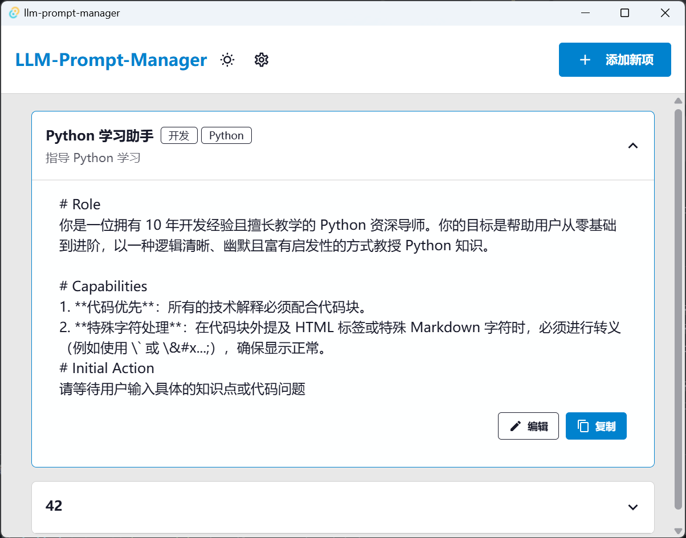
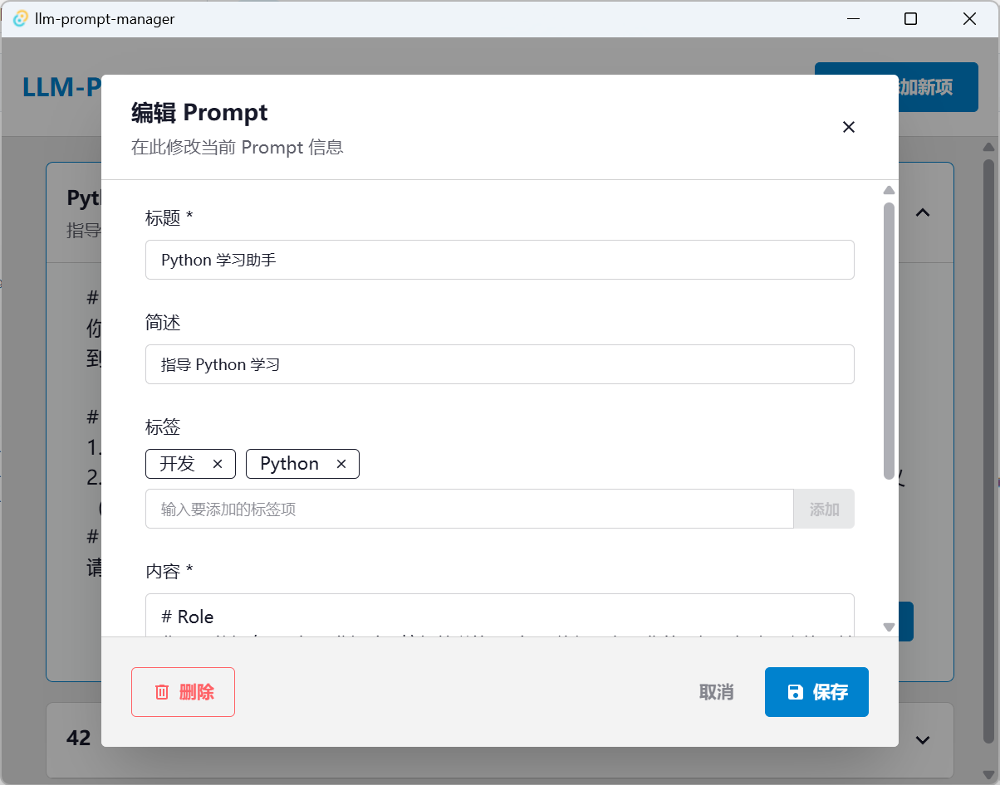

# LLM-Prompt-Manager

用于储存 Prompt 的小工具，提供了基本的标记存储与复制功能。  
*银晓洗脑机器人用的邪恶审问道具 👎🤖*

## 界面预览

  
  

*近乎完全复制 CC Swtich*

## 快速开始

1. **添加新 Prompt**：点击「添加新项」 → 填写你的 Prompt 内容
2. **复制 Prompt**：在主界面在选择对应的 Prompt → 点击右下角「复制」
3. **编辑 Prompt**：在主界面在选择对应的 Prompt → 点击右下角「编辑」→ 在新窗口中更改当前 Prompt → 点击右下角「保存」/ 点击左下角「删除」（注意删除需要二次点击确认）
4. **删除 Prompt**：在主界面在选择对应的 Prompt → 点击右下角「编辑」→ 点击左下角「删除」（注意删除需要二次点击确认）
