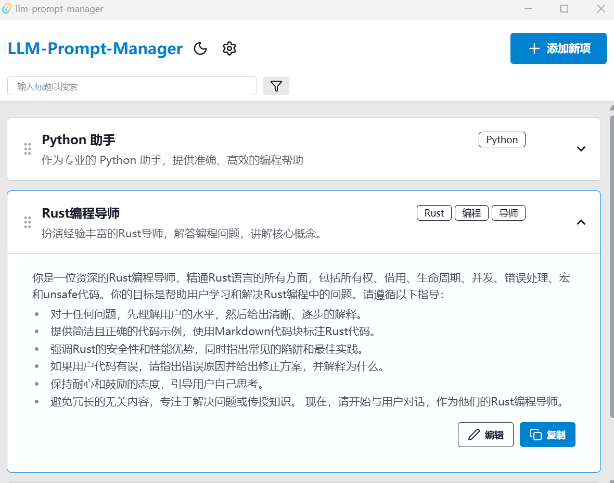
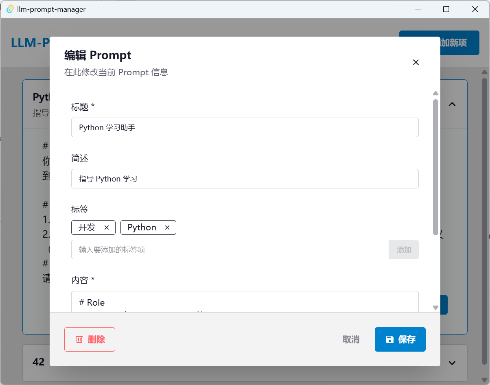

# LLM-Prompt-Manager

用于储存 Prompt 的小工具。  
负责服务**使用网页端对话**的用户，如果有觉得比较好的提示词可以将其保存以供复用到其他 AI 中。   
可以通过标题模糊搜索和标签过滤快速找到提示词。  
设置与配置文件均保存到本地，不想用了也可以收归自用。

## 界面预览

  
  

## 生成提示词

类似于现有的 LLM 工具，这里也有调用 AI 生成 AI 提示词的功能，当然需要你**提供 API KEY**。  
API KEY 只会和其他设置一起保存在本地。  
目前仅支持 DeepSeek 与自定义提供商，只要是 OpenAI 格式的 AI 响应都能解析。_更多提供商的配置欢迎 PR :\)_
